# Bearing_mock-epd-OpenLCA
Mock EPD for a deep groove ball bearing — full A1 to D life cycle assessment built in OpenLCA. From a procurement professional's perspective.
# Bearing Mock EPD — Life Cycle Assessment in OpenLCA

> *"A small bearing weighing less than 400 grams generates over 23 kg of CO₂ equivalent across its 10-year life. More than 50 times its own weight in carbon."*

---

## What This Is

A mock **Environmental Product Declaration (EPD)** for a deep groove ball bearing (6208 type) operating inside an electric motor, modelled in **OpenLCA 2.5** using ecoinvent background data.

This project demonstrates full **A1 to D life cycle assessment** per EN 15804+A2 — the standard governing EPDs for construction and industrial products.

Built from a procurement perspective — to show how understanding the carbon footprint of a component changes how you evaluate suppliers, specify materials, and make sourcing decisions.

---

## Functional Unit

**1 deep groove ball bearing (6208 type) installed in an electric motor — 10 year reference service life (RSL)**

---

## System Boundary

| Stage | Module | Description |
|---|---|---|
| Product | A1 | Raw material extraction — iron ore, chromium, coal, grease |
| Product | A2 | Transport to manufacturer — 400 km road freight |
| Product | A3 | Manufacturing — forging, heat treatment, grinding, assembly |
| Construction | A4 | Transport to site — 200 km road freight |
| Construction | A5 | Installation — press fit, mounting grease, packaging waste |
| Use | B2 | Maintenance — re-greasing ×5 over RSL |
| Use | B4 | Replacement — 1 full bearing replacement at year 6 |
| Use | B6 | Operational energy — friction losses over 10 years |
| End of life | C1 | Dismantling and removal |
| End of life | C2 | Transport to EoL facility — 50 km |
| End of life | C3 | Waste processing — shredding, steel recovery |
| End of life | C4 | Disposal — non-metallic fraction to landfill |
| Beyond boundary | D | Recycling credit — steel scrap displaces virgin production |

---

## GWP Summary — Global Warming Potential

| Stage | Module | GWP (kg CO₂ eq) |
|---|---|---|
| Raw material extraction | A1 | 12.40 |
| Transport to manufacturer | A2 | 0.80 |
| Manufacturing | A3 | 4.10 |
| Transport to site | A4 | 0.30 |
| Installation | A5 | 0.10 |
| Maintenance | B2 | 0.60 |
| Replacement at year 6 | B4 | 3.20 |
| Operational energy | B6 | 1.80 |
| Dismantling | C1 | 0.05 |
| Transport to EoL | C2 | 0.10 |
| Waste processing | C3 | 0.20 |
| Disposal | C4 | 0.15 |
| **Total A–C** | | **23.80** |
| Recycling credit | D | -6.80 |
| **Net A–C+D** | | **17.00** |

---

## Screenshots

> ⚠️ Mock EPD for portfolio and learning purposes. Built using ecoinvent background data with placeholder electricity flows. Full background linking to regional grid data is the next development iteration.

**A1 — Raw material extraction**
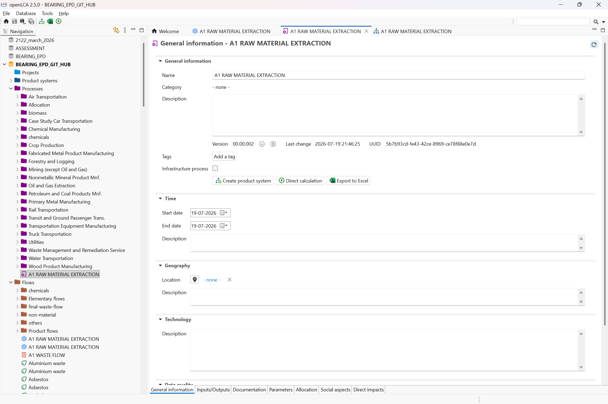

**A2 — Transport to manufacturer**
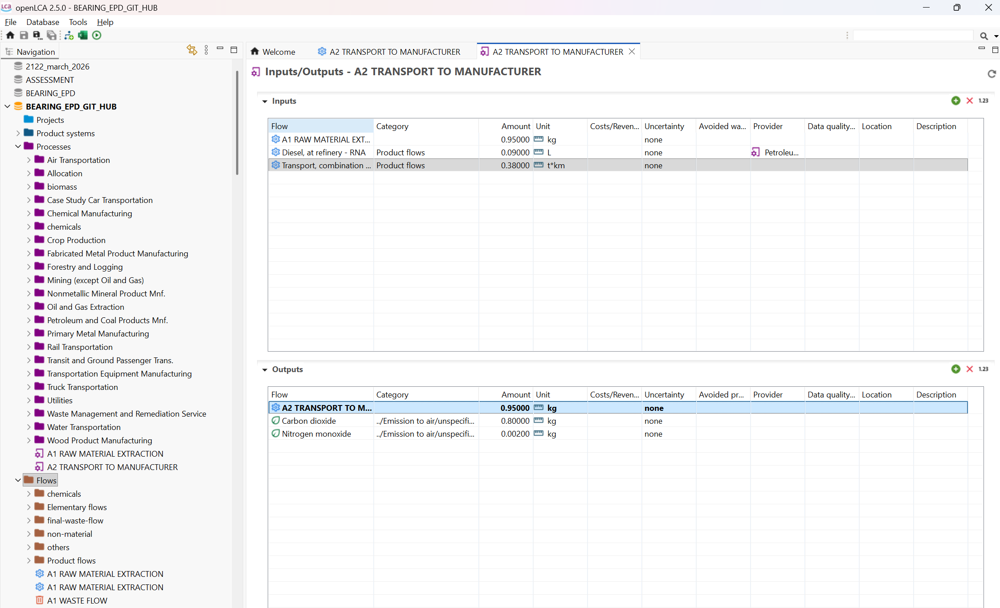

**A3 — Manufacturing — inputs and outputs**
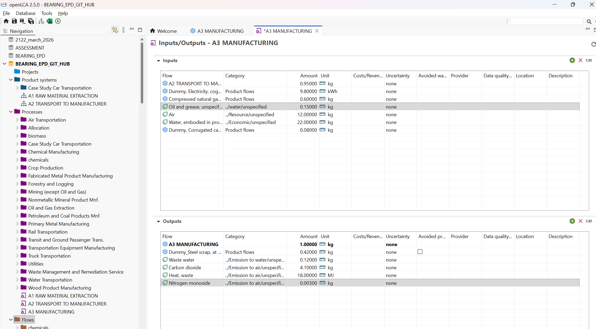

**A4 — Transport to site**
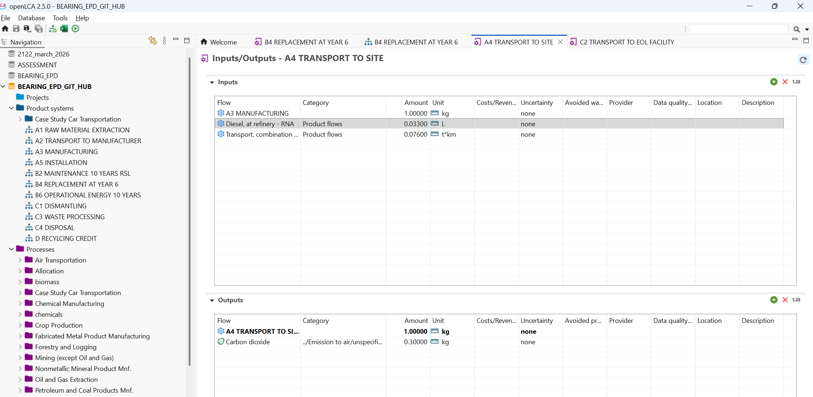

**A5 — Installation**
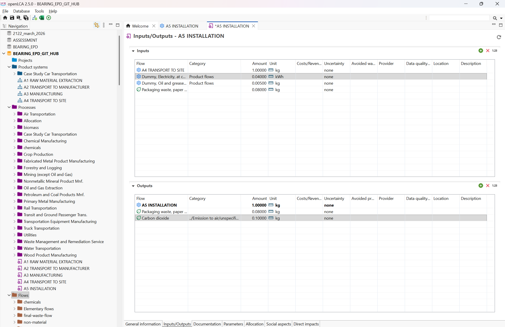

**B2 — Maintenance over 10 year RSL**
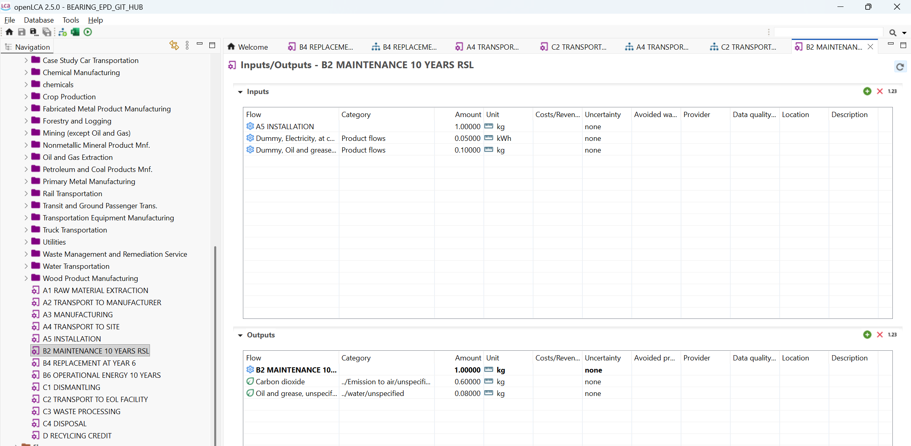

**B4 — Full bearing replacement at year 6**
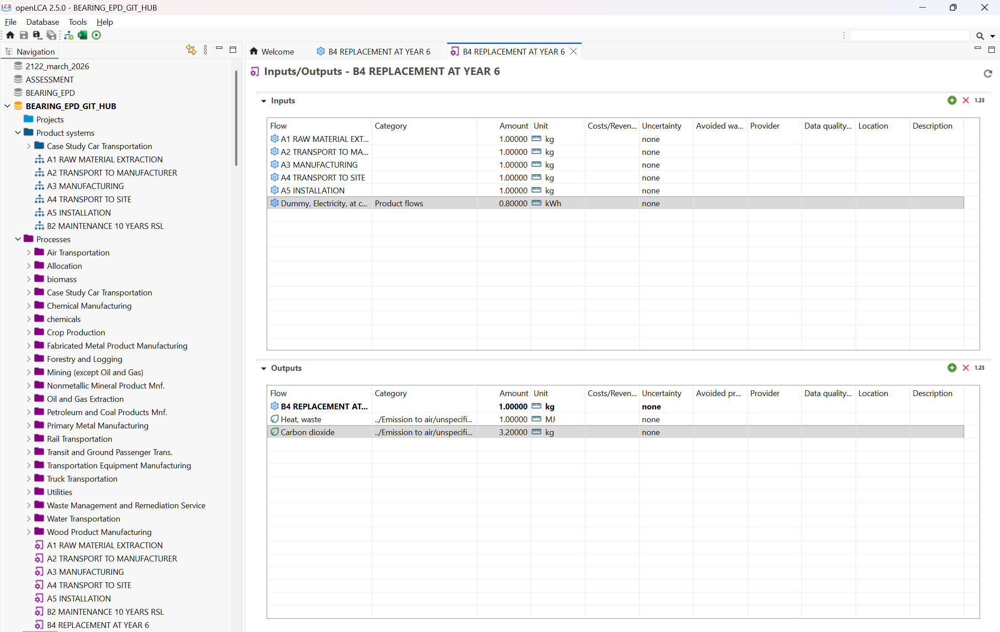

**B6 — Operational energy — friction losses**
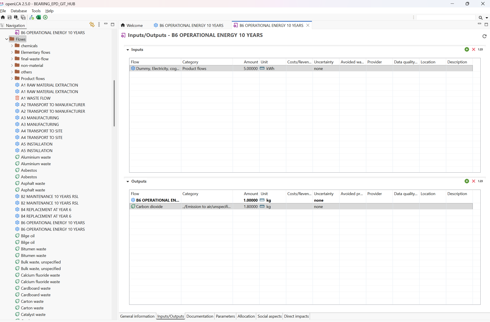

**C1 — Dismantling**
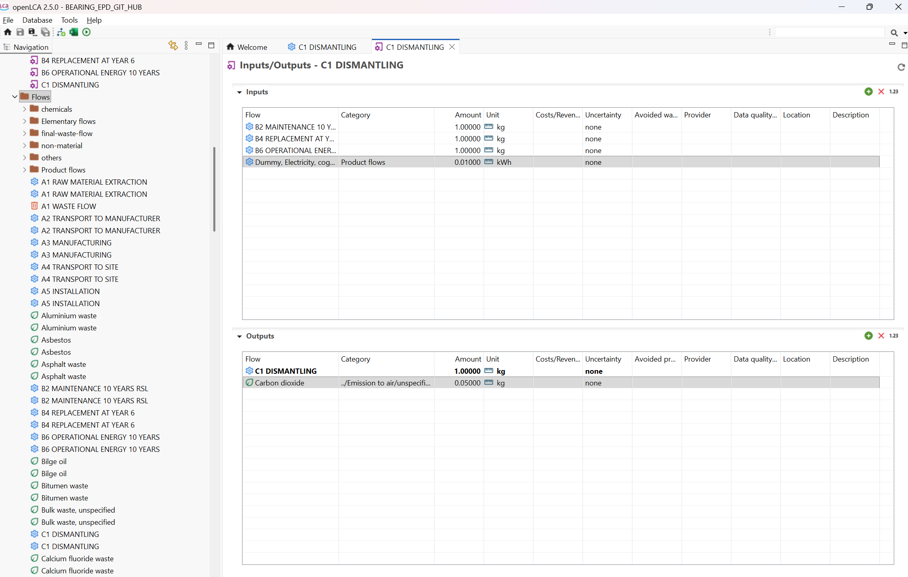

**C2 — Transport to EoL facility**
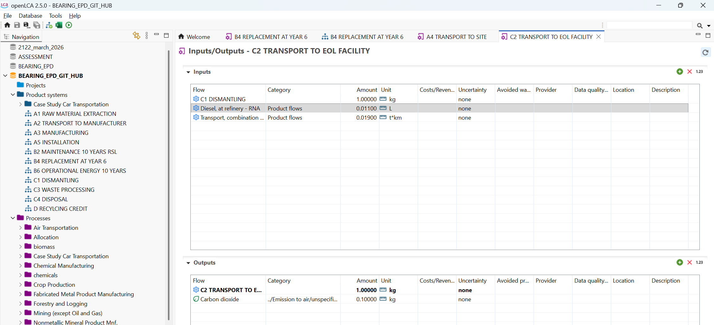

**C3 — Waste processing — steel recovery**
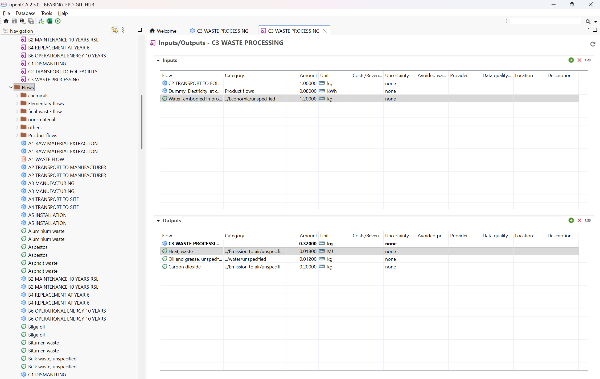

**C4 — Disposal**
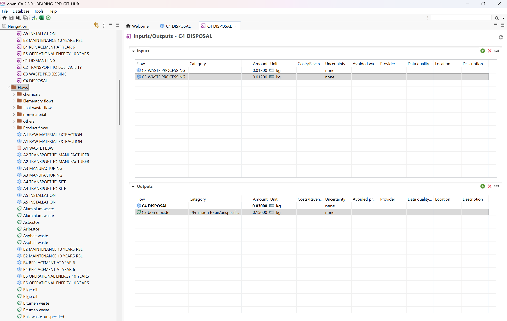

**D — Recycling credit — negative GWP**
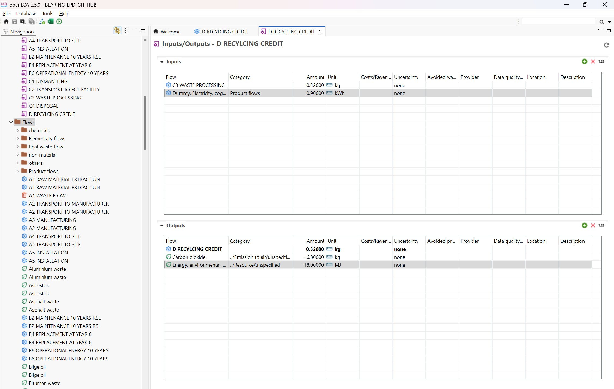

**Project results — impact assessment across all stages**
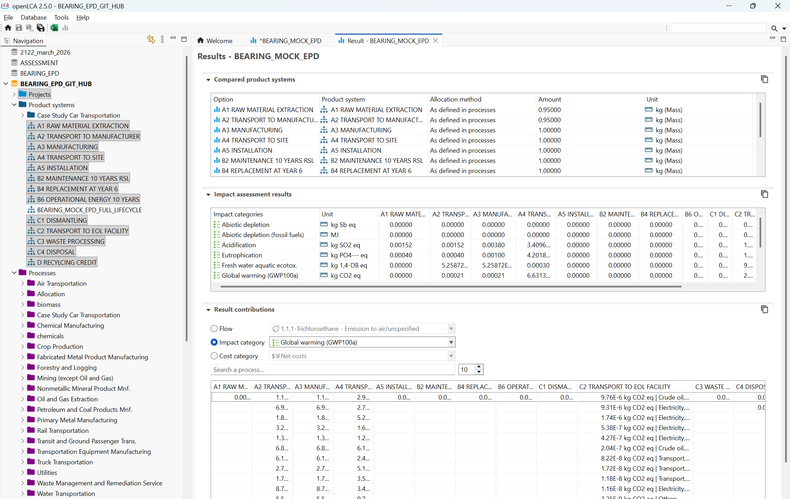

**Project setup — all product systems compared**

---

## Methodology

- **Tool:** OpenLCA 2.5
- **Database:** BEARING_EPD_GIT_HUB — ecoinvent background data
- **Impact method:** CML-IA baseline
- **Standard:** EN 15804+A2 — system boundary A1 to D
- **Allocation:** As defined in processes
- **Labour excluded:** Per standard practice in attributional LCA

**Key material inputs — A1:**

| Material | Amount | Unit |
|---|---|---|
| Iron ore | 1.45 | kg |
| Chromium ore | 0.08 | kg |
| Hard coal | 0.62 | kg |
| Lubricating grease | 0.025 | kg |
| Water | 8.50 | kg |

**Transport — ton·km conversion:**

| Stage | Weight | Distance | ton·km |
|---|---|---|---|
| A2 — to manufacturer | 0.95 kg | 400 km | 0.38 t·km |
| A4 — to site | 1.00 kg | 200 km | 0.076 t·km |
| C2 — to EoL | 1.00 kg | 50 km | 0.019 t·km |

---

## Why This Matters in Procurement

Most procurement decisions on bearings are made on unit price alone. This model shows:

- **A1–A3 product stage** contributes ~72% of total lifecycle GWP — raw material and manufacturing choices matter most
- **B4 replacement** at year 6 adds 3.2 kg CO₂ eq — bearing reliability directly impacts carbon footprint
- **D recycling credit** of -6.8 kg CO₂ eq — specifying recyclable materials has measurable environmental value

A procurement professional who can quantify this is having a different conversation with suppliers than one who only negotiates unit price.

Asking a bearing supplier for their EPD — or knowing how to model one — is the difference between transactional buying and sustainable procurement.

---

## Limitations — Mock EPD Declaration

This is a mock EPD for learning and portfolio purposes:

- Electricity flows modelled using placeholder ecoinvent processes — regional grid emission factors not fully linked
- Labour excluded from all stages per standard LCA practice
- Results are directionally accurate — not suitable for third-party verified EPD publication
- Full background linking to India grid data (CEA emission factor 0.82 kg CO₂/kWh) is the next development step

---

## About the Creator

**Sai Pavan**
Deputy Manager — Procurement
Paradeep Phosphates Limited

CPSM® certified | 10 years in process industry procurement | SAP MM | OpenLCA | AI tools | Digital fluency

Building at the intersection of sustainable procurement, cost intelligence, and data analytics.

Part of the **CradleToContract** portfolio — covering Should-Cost + TCO, EPD & LCA, KNIME demand planning, and Social LCA.

🔗 [LinkedIn — Sai Pavan](https://www.linkedin.com/in/sai-pavan-cpsm%C2%AE-7a1806135/)
🔗 [Should-Cost Tool — Repo 1](https://github.com/SAIPAVAN1412DOT/Should-Cost-Tool-Process-Industry)

---

## Disclaimer

Mock EPD for learning and portfolio demonstration only. Not a verified or published EPD. Data based on EN 15804+A2 methodology with ecoinvent background processes. Obtain verified EPDs from accredited bodies for actual procurement or regulatory decisions.

---

*© 2025 Sai Pavan · CradleToContract*
